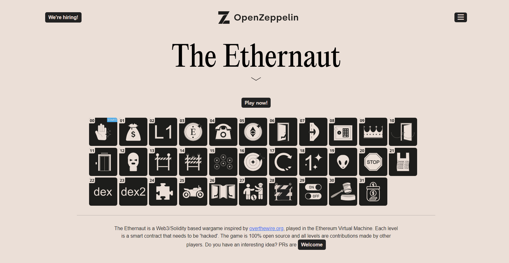
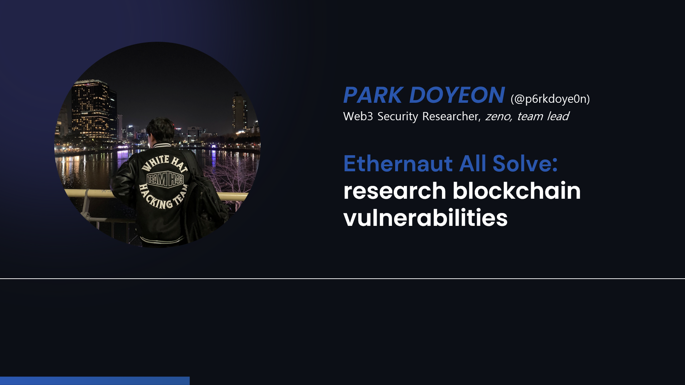

## Ethernaut All Solve / Blockchain wargame write-up code

 
To study and research blockchain vulnerabilities, I share Ethernaut all solve code, a war game site created by openzeppelin.

I think it is a useful reference for many people when studying.

## Getting Started

The codes are based on the foundry framework, which makes more smart contract calls easy.

So, in order to use the code, foundry must be installed by default, and then run the code.

## About Park DoYeon

I am attending at Korea University in the Department of Cyber Defense and am an active white hat hacker with TeamH4C. I am working as a web3 auditor in South Korea and a bug hunter on Immunefi, leading Zeno, a web3 offensive security team that analyzes and patches vulnerabilities from an offensive perspective in the web3 ecosystem.

I analyze not only vulnerabilities that may occur within smart contracts but also potential vulnerabilities that may arise when interacting with the web, based on real-world experience. I create and patch various attack scenarios to provide the most reliable security audit and development services for products.

I have won multiple awards in various competitions and have numerous projects and research achievements. Additionally, I have participated in several hackathons and have a variety of development stacks.

Contact: parkttule0305@gmail.com
Auditor Information: https://p6rkdoye0n-eth.notion.site/p6rkdoye0n-98c9fc56e74347cc965c7e05456f4af5
